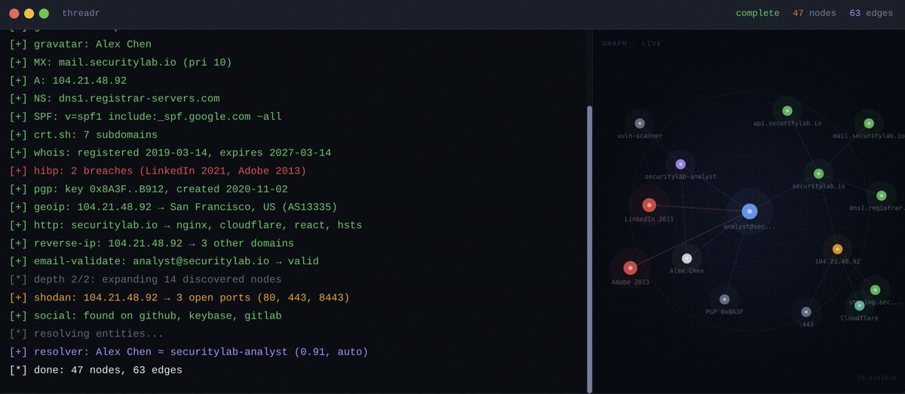

# threadr

[](https://github.com/Giuseppe552/threadr/actions/workflows/ci.yml)
[](LICENSE)
[]()
[]()

OSINT tool for security professionals. Feed it an email, domain, or username — it maps connected accounts, infrastructure, and metadata into a graph.



100% self-hosted. No cloud. No telemetry. Your keys, your data.

## Run it

```sh
git clone https://github.com/Giuseppe552/threadr.git && cd threadr
cp .env.example .env          # set NEO4J_PASSWORD, REDIS_PASSWORD
docker compose up -d
open http://localhost
```

Requires `.env` with `NEO4J_PASSWORD` and `REDIS_PASSWORD` — docker compose will refuse to start without them.

## CLI

```sh
npm run cli -- scan user@example.com                          # JSON to stdout
npm run cli -- scan example.com --depth 3 -f graphml > out.xml  # GraphML export
npm run cli -- scan example.com --stealth --proxy-ports 9051-9055  # anonymous
npm run cli -- plugins                                        # list all 17
npm run cli -- audit --proxy-ports 9051-9055                 # verify anonymity
```

## Plugins

| plugin | accepts | key | |
|--------|---------|-----|-|
| github | Email | | users, repos |
| crt.sh | Domain | | CT → subdomains |
| dns | Domain | | A/AAAA/MX/NS/TXT/SOA/CNAME, SPF |
| gravatar | Email | | profile via md5 |
| social | Username | | 8 platforms |
| shodan | IP, Domain | yes | ports, banners |
| git-emails | Repo | | commit emails |
| whois | Domain | | registrar, registrant |
| virustotal | Domain, IP | yes | malicious score |
| pgp | Email | | keyserver lookup |
| hibp | Email | yes | breach history |
| reverse-dns | IP | | PTR records |
| reverse-ip | IP | | co-hosted domains |
| geoip | IP | | country, city, ASN |
| http-fp | Domain | | server, CDN, CMS |
| email-check | Email | | SMTP probe, catch-all |
| securitytrails | Domain, IP | yes | passive DNS, subdomains |

13 work without keys. 4 need your own API keys (set in the UI or `.env`).

<details>
<summary><strong>Analytics engine</strong></summary>

Five mathematical analysis layers, all in `packages/shared/src/analytics/`:

| Engine | Method | What it does |
|--------|--------|-------------|
| Evidence fusion | Dempster-Shafer | Fuses conflicting plugin outputs with proper uncertainty handling |
| Spectral clustering | Graph Laplacian eigendecomposition | Identity community detection, bridge nodes, anomalies |
| Link prediction | Katz centrality + Jaccard + Adamic-Adar | Predicts edges that should exist but weren't observed |
| Exposure scoring | Shannon entropy | Per-identity risk score in bits |
| Graph distance | Wasserstein (Hungarian algorithm) | Optimal transport between scan snapshots |

</details>

<details>
<summary><strong>Stealth mode</strong></summary>

`--stealth` enables 7 anonymity layers:

- Per-plugin Tor circuit isolation (HMAC-SHA256 keyed by per-session nonce — mapping changes every scan)
- Chrome header order mimicry (sec-ch-ua, Sec-Fetch-*, exact order)
- Session cookies + referrer chains per domain
- Lévy stable timing (α=1.5, infinite variance — defeats KS test)
- Markov chain cover traffic (7-state browsing model)
- k-anonymity target decoys (identification probability: 1/(k+1))
- TLS cipher shuffle (JA3 randomisation)

Start Tor: `docker compose --profile tor up -d`

Self-audit: `npm run cli -- audit --proxy-ports 9051-9055`

</details>

<details>
<summary><strong>Entity resolution</strong></summary>

When the same real person appears through different plugins (GitHub username, email, domain registrant), the resolver identifies matches using Jaro-Winkler string similarity across multiple fields (emails, usernames, names, avatar hashes).

A blocking index avoids brute-force all-pairs comparison. Entities are indexed by exact tokens (emails, usernames, avatar hashes) and name bigrams. Only pairs sharing a token become candidates for full comparison. Buckets with >50 entities are dropped as noise.

Result: 1,000 persons compares ~5,000 candidate pairs instead of 499,500. Matches above 0.85 confidence are auto-merged. 0.6–0.85 are flagged for review.

</details>

<details>
<summary><strong>Security hardening</strong></summary>

Self-audited March 2026. [Writeup](https://giuseppegiona.com/writing/auditing-my-own-osint-tool).

- **Query injection** — Neo4j labels and relationship types validated against a whitelist before query execution. Backtick-escaped as defence-in-depth.
- **Graph expansion limits** — max depth 2, max 200 nodes per batch, max 2,000 total. Prevents combinatorial explosion from high-connectivity seeds.
- **Plugin timeouts** — 30s per plugin execution. Hanging plugins can't block the worker.
- **API key encryption** — AES-256-GCM at rest, key derived from env secret via HKDF-SHA256. Backwards-compatible with plaintext during migration.
- **Neo4j resilience** — 5-failure threshold before pausing writes, health reset at scan start.
- **No default credentials** — docker compose requires `.env` with passwords set.

</details>

<details>
<summary><strong>Cryptographic accounts</strong></summary>

ECDSA P-256 keypair auth. No email, no KYC.

- Generate keypair in browser → public key = identity
- Challenge-response authentication (no passwords)
- HMAC-SHA256 stateless sessions
- API keys encrypted at rest (AES-256-GCM via HKDF)

</details>

## Stack

```
web      React + Vite + Tailwind + react-force-graph-2d
api      Hono + SQLite (WAL) + token/ECDSA auth
worker   BullMQ + 17 plugins + Dempster-Shafer resolver
stealth  Tor SOCKS5 + browser mimicry + Lévy timing + DoH
graph    Neo4j + Cypher + 3-hop traversal
queue    Redis
```

## Develop

```sh
npm install
cp .env.example .env
docker compose up neo4j redis -d
npm run build && npm run dev
npm test                         # 331 tests across 31 files
```

## Contributing

See [CONTRIBUTING.md](CONTRIBUTING.md). Plugins are ~30 lines each. Issues labeled [`good first issue`](https://github.com/Giuseppe552/threadr/labels/good%20first%20issue) are ready to pick up.

## License

MIT
